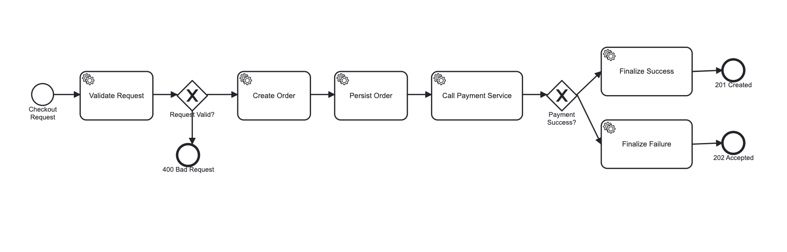

# SOAL 2


## 🚀 BPMN Checkout Process


📌 Please checkout branch feature/mysql-checkout

```bash
git checkout feature/mysql-checkout
```

1️⃣ Start Event – Checkout Request

Trigger: POST /checkout

Source: Client (Frontend / API consumer)

📌 Di kode

```bash
@POST
public Response checkout(CheckoutRequest req)
```


2️⃣ Service Task – Validate Input

Fungsi:

Memastikan productId dan userId tidak null

Outcome:

❌ Invalid → langsung return 400 Bad Request

✅ Valid → lanjut proses

📌 Di kode

```bash
if (req == null || req.productId == null || req.userId == null) {
    return Response.status(Response.Status.BAD_REQUEST)
        .entity("productId and userId are required").build();
}

```

➡️ BPMN note: ini biasanya dimodelkan sebagai

Service Task + Exclusive Gateway
atau

Service Task dengan Error End Event

3️⃣ Service Task – Create Order (PENDING)

Fungsi:

Membuat objek Order

Hitung totalPrice

Set status PENDING

📌 Di kode

```bash
Order order = new Order();
order.productId = req.productId;
order.userId = req.userId;
order.quantity = ...;
order.totalPrice = order.quantity * price;
order.status = "PENDING";
order.createdAt = LocalDateTime.now();

```

4️⃣ Service Task – Persist Order

Fungsi:

Menyimpan order ke database

Dilakukan dalam transaksi sendiri

📌 Di kode

```bash
persistOrder(order);

@Transactional
void persistOrder(Order order) {
    order.persist();
}
```

5️⃣ Service Task – Call Payment Endpoint

Fungsi:

HTTP POST ke payment provider eksternal

Mengirim orderId dan amount

Membaca response

📌 Service yang digunakan:

HttpURLConnection

External Payment Service

📌 Di kode

```bash
URL url = new URL(paymentEndpoint);
HttpURLConnection con = (HttpURLConnection) url.openConnection();
con.setRequestMethod("POST");
...

```

6️⃣ Exclusive Gateway – Payment Success?

Decision rule:

Jika response status = SUCCESS / COMPLETED → Success path

Selain itu → Failure path

📌 Di kode

```bash
if (st != null && ("SUCCESS".equalsIgnoreCase(st.toString())
    || "COMPLETED".equalsIgnoreCase(st.toString()))) {
    paymentSuccess = true;
    paymentStatus = "COMPLETED";
}

```

7️⃣ Service Task – Finalize Success

Fungsi:

Update order → COMPLETED

Insert payment record → COMPLETED

📌 Di kode

```bash
finalizeSuccess(order.id, order.totalPrice, paymentResponseRaw);

o.status = "COMPLETED";
p.status = "COMPLETED";

```

➡️ BPMN End Event:
End – 201 CREATED

8️⃣ Service Task – Finalize Failure

Fungsi:

Update order → FAILED

Insert payment record → FAILED

📌 Di kode

```bash
finalizeFailure(order.id, paymentResponseRaw);

o.status = "FAILED";
p.status = "FAILED";

```
➡️ BPMN End Event:
End – 202 ACCEPTED


🧪 CONTOH “TEST CODE” (KONSEPTUAL BPMN TEST)

✅ Test Case: Payment Success
```bash
Given request with productId & userId
When payment endpoint returns { status: "SUCCESS" }
Then:
- Order status = COMPLETED
- Payment status = COMPLETED
- Response = HTTP 201

```

❌ Test Case: Payment Failed
```bash
Given request with productId & userId
When payment endpoint returns error / FAILED
Then:
- Order status = FAILED
- Payment status = FAILED
- Response = HTTP 202

```

❌ Test Case: Invalid Input
```bash
Given request without productId
Then:
- Process ends at validation
- Response = HTTP 400

```

